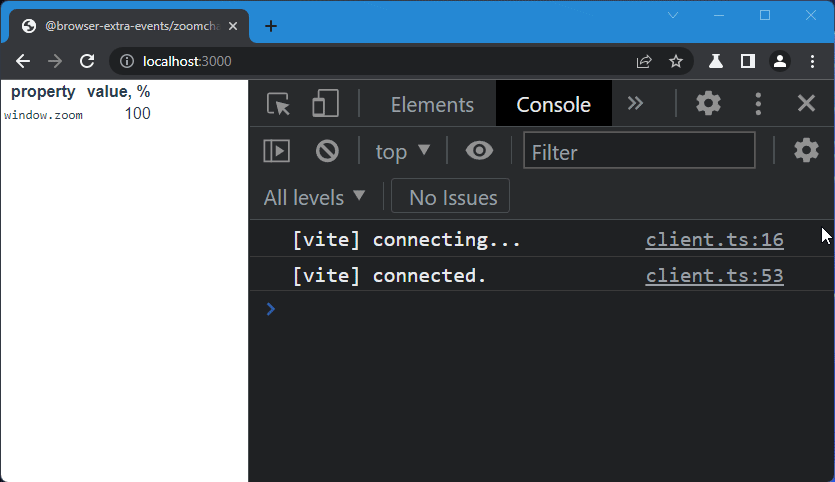

# @browser-extra-events/zoomchange

Fires `zoom` event on [`window`] each time user changes browser zoom ratio.



## Usage

With bundlers:

```
npm install @browser-extra-events/zoomchange
```

and

```js
import '@browser-extra-events/zoomchange'
```

Plain html:

```html
<script
  src="https://cdn.jsdelivr.net/npm/@browser-extra-events/zoomchange/dist/zoomchange.min.js">
</script>
```

[`window`]: https://developer.mozilla.org/en-US/docs/Web/API/Window